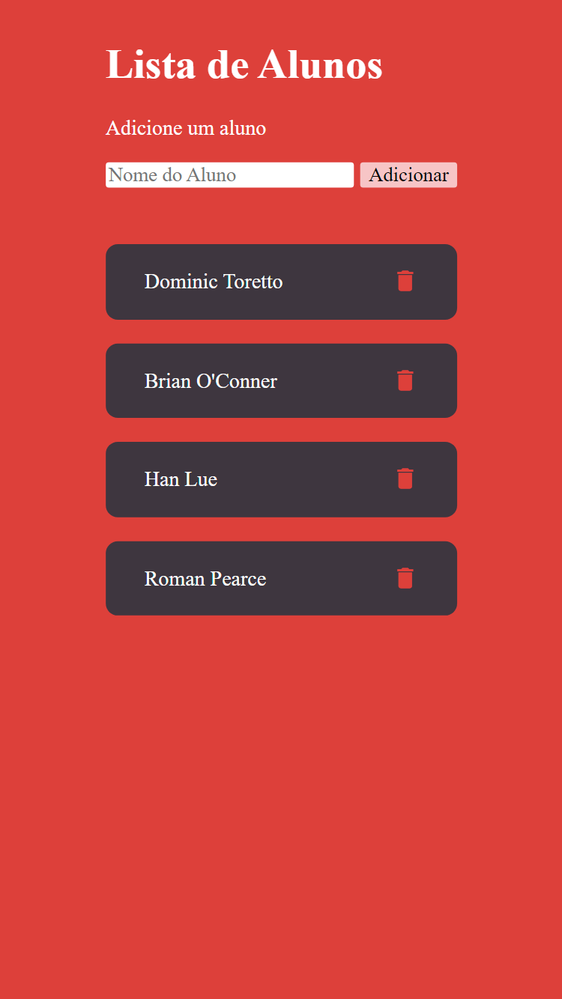

## 🚀 Desafios [Aula 22-08]()

Desenvolver uma pagina html que possua uma lista de alunos com as funcionalidades de adicionar e remover.

## 🎮 Techs 
Este projeto foi desenvolvido utilizando as seguintes tecnologias:
- [HTML](https://developer.mozilla.org/pt-BR/docs/Web/HTML)
- [CSS](https://developer.mozilla.org/pt-BR/docs/Web/CSS)
- [Javascript](https://developer.mozilla.org/pt-BR/docs/Web/JavaScript)

## 🎨 Preview

  

## 🚩 Funcionalidades

- [X]  Crie uma página HTML com o título "Minha página"
- [X]  A página deve ter o 'background' vermelho, e todo o texto deve ser branco
- [X]  A página deve conter uma lista de alunos
- [X]  A página deve fornecer um cadastro de alunos
- [X]  Ao cadastrar um aluno, a lista de alunos deve ser atualizada
- [X]  O usuário deve poder excluir um aluno

## 🤖Autor 
Feito por Matheus Campos

 

